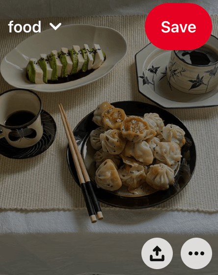

# Ejercicio 2

Implementa este diseño de manera que:
* THaya comida en la esquina superior izquierda de esta imagen.
* Haya un botón en la esquina superior derecha de esta imagen.
* Haya dos botones de logo en la esquina inferior derecha de esta imagen.
